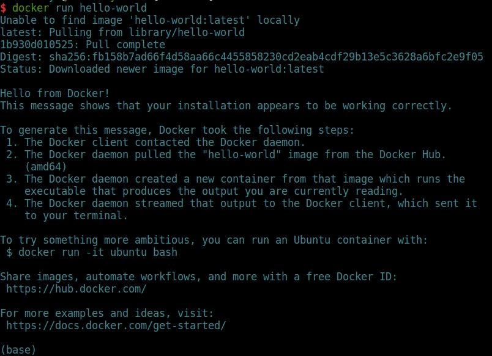
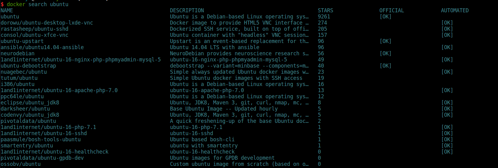
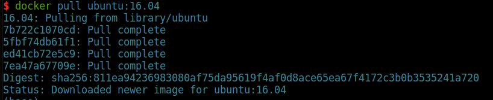
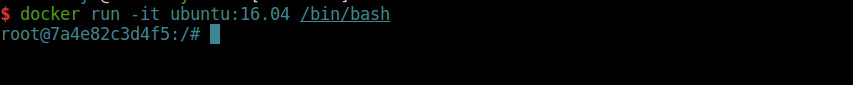
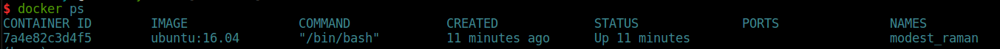
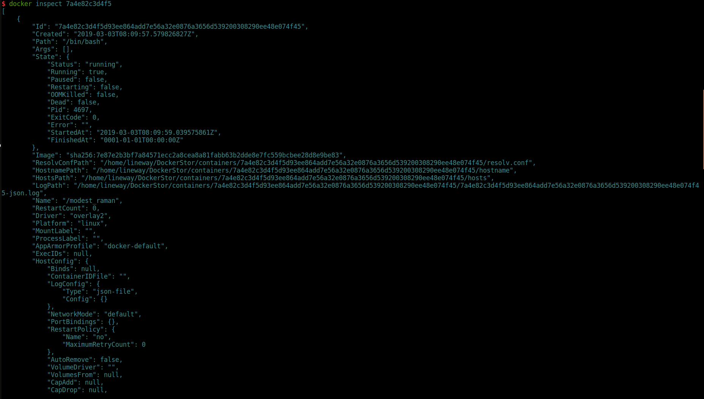
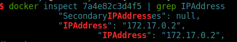

title: start-docker--安装docker及运行容器
date: 2019-03-02 22:59:39
tags:  docker
categories: 容器技术


## 安装Docker

`Docker`的安装根据具体操作系统的不同有一点区别，这里使用`Ubuntu16.04`进行安装示例。

首先，安装最新版的`Docker CE`需要先卸载掉之前的版本，由于历史原因，旧版本的`Docker`可能命名为`docker`、`docker.io`或者`docker-engine`：

```bash
sudo apt-get remove docker docker-engine docker.io containered runc
```

接着，开始进行安装操作：

```bash
sudo apt-get update
sudo apt-get install apt-transport-https ca-certificates curl gnupg-agent software-properties-common
# 添加Docker的官方GPG key
curl -fsSL https://download.docker.com/linux/ubuntu/gpg | sudo apt-key add -
# 设置存储库(64位系统)
sudo add-apt-repository "deb [arch=amd64] https://download.docker.com/linux/ubuntu $(lsb_release -cs) stable"
# 安装最新版docker-ce
sudo apt-get update
sudo apt-get install docker-ce docker-ce-cli containerd.io

# 也可以选择特定版本的docker-ce
apt-cache madison docker-ce
# 在返回的查找结果中选择需要的版本
sudo apt-get install docker-ce=<VERSION_STRING> docker-ce-cli=<VERSION_STRING> containerd.io
```

安装完成后，`docker`会在后台自动启动，这时候查看`docker`信息：

```bash
sudo docker info
```

默认执行`docker`相关命令需要使用`sudo`，如果需要给普通用户配置`docker`权限，可使用如下命令：

```bash
sudo usermod -aG docker <username>
sudo service docker restart
```

执行完成后，退出操作系统重新登录即可。

## 卸载Docker

在`Ubuntu`下，卸载`Docker`只需要执行：

```bash
sudo apt-get purge docker-ce
```

然后删除主机上的镜像、容器、卷等信息，默认情况下，直接删除`/var/lib/docker`即可，如果主机上的`docker`镜像等存储位置发生过变化，则需要删除对应目录。

## 运行Docker容器

安装完成后，尝试如下命令测试`Docker`是否安装正确：

```bash
docker run hello-world
```

结果如下所示：

则证明`docker`安装正确，`hello-world`是一个很小的镜像，主要作用就是测试`Docker`是否安装正确。

我们在上面使用了`docker run`的命令，这个命令负责启动容器，如果本地不存在需要启动的镜像，则会去镜像仓库下载镜像，然后再启动。如输出的第一行`Unable to find image 'hello-world:latest'locally`。

其中，镜像的名称包含该两部分，分别是`镜像名称`和`标签`，上述的`hello-world`就是镜像名称，`latest`就是镜像的标签（tag）。如果下载镜像时，不指定标签，则默认使用`latest`。

### 运行一个可用的容器

上面介绍了简单的`docker run`命令，但是，在实际的使用中，我们不可能只需要容器输出一段文字就可以了，这对于我们来说毫无意义。下面，我们就运行一个常规的容器，并简单介绍一些容器的使用命令。

首先，我们在镜像仓库中查找一下想要运行的容器镜像：

在输出中可以看到，镜像仓库中包含很多`ubuntu`镜像，其中`OFFICIAL`标记为`OK`的镜像是指官方镜像，一般情况下我们优先选择官方镜像。接下来，我们从仓库中下载镜像：

我们下载了`ubuntu`的镜像，选择`tag`为`16.04`，输出上述信息，表示镜像已经完全下载到本地主机，可以开始使用了。

使用`docker run -it <image:tag> /bin/bash`启动一个容器，启动后，自动进入到容器内部。其中：

- `-it`命令是`-i`和`-t`命令合在一起的，`-i`是指`--interactive`。表示打开`STDIN`，即使在没有连接的情况下；`-t`指的是`--tty`，表示为容器分配一个伪的`tty`交互会话；
- `/bin/bash`参数表示进入容器后需要获得一个`bash shell`。

从上述容器启动命令可以大概看出，容器在启动时可以增加额外的启动参数，其具体形式如下：

```bash
docker run [OPTIONS] IMAGE [COMMAND] [ARG...]
```

具体可加入的选项(`OPTIONS`)以及命令(`COMMAND`)和参数(`ARG`)可以查阅[官方文档](https://docs.docker.com/v17.09/engine/reference/commandline/run/)。

启动一个容器后，我们可以重新打开一个终端，查看启动容器的相关信息：

使用`docker ps`命令可以查看到正在运行中的容器的简略信息，其中包含容器ID、镜像信息、执行的命令、创建的时间、状态、端口映射以及容器名称。其中，容器的名称如果在创建容器时没有制定，则`docker`会随机分配一个名称。当然，我们还可以使用`docker inspect`命令来查看容器的详细信息：

由于容器的详细信息过多，这里只截取了部分信息。在使用`docker inspect`来获取容器的详细信息时，我们可以使用如下方式过滤输出，只获取我们需要的信息：

- `docker inspect<container_id or container_name> | grep <info>`，如`docker inspect 7a4e82c3d4f5 | grep IPAddress`则输出如下：

  

- `docker inspect --format `的方式进行查询，该方式使用的是`go`语言模板：

  

上述两种方式，都可以查看容器相关信息，其中第二种方式使用的是`go`语言模板的方式实现的，具体可查阅`go`语言相关文档。

使用`docker logs`命令，以容器名或ID为参数，就可以获取到该容器的日志信息，这里不做演示，可以自行操作。

在容器中，输入`exit`就可以退出容器，在我们演示的这个容器中，退出容器的同时，容器也会停止。这时候使用`docker ps`是没有容器信息返回的，可以使用`docker ps -a`进行查看，正常退出的容器可以使用`docker start <container_id or container_name>`进行重启。

如果确认不需要的容器，可以使用`docker stop`命令停止该容器，然后再使用`docker rm`命令将这个容器删除，需要注意的是`docker rm`是删除容器的命令，`docker rmi`是删除镜像的命令。

以上就是安装`docker`和运行容器的简单操作，后续我们则从实际出发，介绍容器的相关内容。
